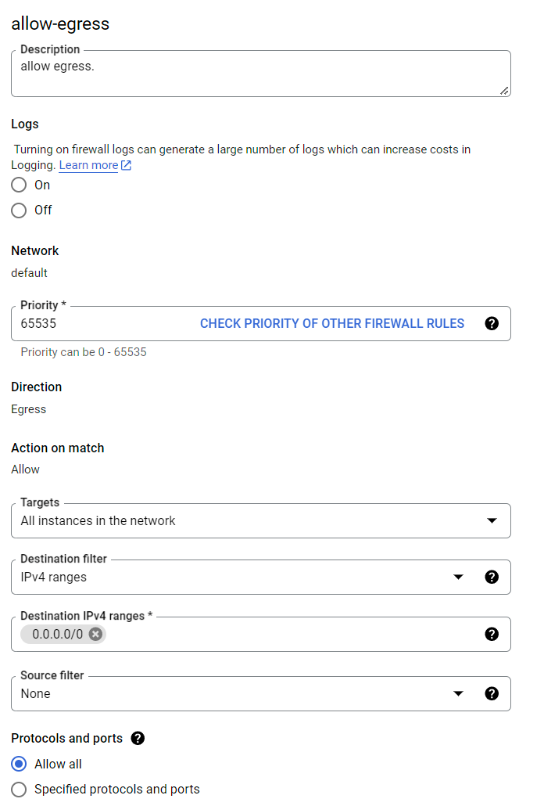

#### GCP setup guide
1. Go to GCP console, in VPC Network -> Firewall, create a new rule, set fields as shown in the following picture:  

2. copy the [setup script](./dask.sh) to any google cloud storage bucket
3. run the following commands on google cloud shell, change the variables accourdingly.
```
CLUSTER_NAME=dask
REGION=us-central1
SETUP_SCRIPT=gs://dataproc-staging-us-central1-348367693788-c69smbbk/dask.sh

gcloud dataproc clusters create ${CLUSTER_NAME} \
  --region ${REGION} \
  --master-machine-type n1-standard-8 \
  --worker-machine-type n1-standard-8 \
  --image-version 2.1-ubuntu \
  --initialization-actions  ${SETUP_SCRIPT}\
  --metadata dask-runtime=yarn \
  --optional-components JUPYTER \
  --enable-component-gateway
```
You can also find our demo python script for running solar-data-tools in parallel on the cloud [here](./demo_cassandra_worker_pulls_own_data.py).
#### References:
https://towardsdatascience.com/serverless-distributed-data-pre-processing-using-dask-amazon-ecs-and-python-part-1-a6108c728cc4
https://aws.amazon.com/blogs/machine-learning/machine-learning-on-distributed-dask-using-amazon-sagemaker-and-aws-fargate/
https://cloud.google.com/blog/products/data-analytics/improve-data-science-experience-using-scalable-python-data-processing

#### Appendix: dask_cloudprovider
During our work, it has come to our attention that the dask-distributed package has not been updated since 2022, but the dask_cloudprovider library is more updated. We have experimented with using GCP with dask_cloudprovider library but did not have luck on our side. The library fails at scheduler creation because it is mistaking the internal IP of the cluster as the external one. However, as Dask continue to develope, the dask_cloudprovider may work in the future, so we are keeping a note here.