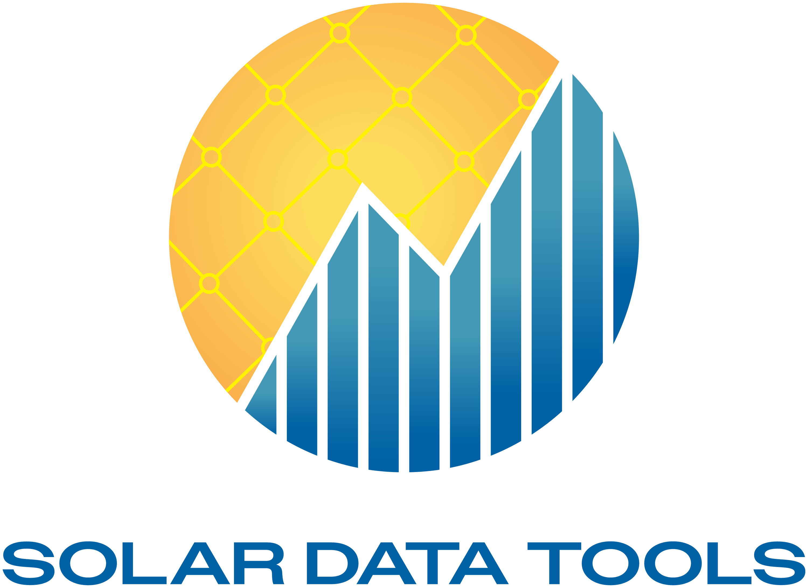

<table>
<tr>
  <td>Latest Release</td>
  <td>
    <a href="https://pypi.org/project/solar-data-tools/">
        
    </a>
    <a href="https://anaconda.org/slacgismo/solar-data-tools">
        
    </a>
    <a href="https://anaconda.org/slacgismo/solar-data-tools">
        
    </a>
</tr>
<tr>
  <td>License</td>
  <td>
    <a href="https://github.com/slacgismo/solar-data-tools/blob/master/LICENSE">
        
    </a>
</td>
</tr>
<tr>
  <td>Build Status</td>
  <td>
    <a href="https://solar-data-tools.readthedocs.io/">
        
    </a>
        <a href="https://github.com/slacgismo/solar-data-tools/actions/workflows/test.yml">
        
    </a>
    <a href="https://github.com/slacgismo/solar-data-tools/actions/workflows/build.yml">
        
    </a> 
  </td>
</tr>
<tr>
    <td>Publications</td>
    <td>
        <a href="https://zenodo.org/badge/latestdoi/171066536">
            
        </a>
    </td>
</tr>
<tr>
    <td>PyPI Downloads</td>
    <td>
        <a href="https://pepy.tech/project/solar-data-tools">
            
        </a>
    </td>
</tr>
<tr>
    <td>Conda Downloads</td>
    <td>
        <a href="https://anaconda.org/slacgismo/solar-data-tools">
            
        </a>
    </td>
</tr>
<tr>
    <td>Test-Coverage</td>
    <td>
        
    </td>
</tr>
</table>

Solar Data Tools is an open-source Python library for analyzing PV power (and irradiance) time-series data. It provides
methods for data I/O, cleaning, filtering, plotting, and analysis. These methods are largely automated and require little
to no input from the user regardless of system type—from utility tracking systems to multi-pitch rooftop systems. Solar Data Tools
was developed to enable analysis of _unlabeled_ PV data, i.e. with no model, no meteorological data, and no performance index required,
by taking a statistical signal processing approach in the algorithms used in the package’s main data processing pipeline.
Head over to our Getting Started pages in our [docs](https://solar-data-tools.readthedocs.io/) for a demo of Solar Data Tools!

You can also check the [notebooks](https://github.com/slacgismo/solar-data-tools/blob/main/notebooks/examples) folder in this repo for more examples.

## Install & Setup

#### Recommended: Install with pip

In a fresh Python virtual environment, simply run:

```bash
$ pip install solar-data-tools
```

or if you would like to use MOSEK, install the optional dependency as well:

```bash
$ pip install "solar-data-tools[mosek]"
```

#### Install with conda

>[!WARNING]
> When installing solar-data-tools using conda, you will need to add three channels, conda-forge, slacgismo, and stanfordcvxgrp, to your conda config (or alternatively specify them using the `-c` flag as shown in the examples below). Failure to do so will result in the installation of an outdated solar-data-tools version. Note that we will be moving solar-data-tools to conda-forge soon, which will simplify the installation process. Check back soon for an update! For more on conda channels, see the [conda docs](https://conda.io/projects/conda/en/latest/user-guide/tasks/manage-channels.html).

Creating the environment and directly installing the package and its dependencies from the appropriate conda channels:

```bash
$ conda create -n pvi-user solar-data-tools -c conda-forge -c slacgismo -c stanfordcvxgrp 
```

Starting the environment:

```bash
$ conda activate pvi-user
```

Stopping the environment:

```bash
$ conda deactivate
```

Or alternatively install the package in an already existing environment:

```bash
$ conda install solar-data-tools -c conda-forge -c slacgismo -c stanfordcvxgrp 
```

### Solvers

#### CLARABEL

By default, the [CLARABEL](https://clarabel.org/stable/) solver is used to solve the signal decomposition problems. CLARABEL (as well as other solvers) is compatible with [OSD](https://github.com/cvxgrp/signal-decomposition/tree/main), the modeling language used to solve signal decomposition problems in Solar Data Tools. Both are open source and are dependencies of Solar Data Tools. 

#### MOSEK

MOSEK is a commercial software package. Since it is more stable and offers faster solve times,
we provide continuing support for it (with signal decomposition problem formulations using CVXPY). However,
you will still need to obtain a license. If installing with pip, you can install the optional MOSEK dependency by running 
`pip install "solar-data-tools[mosek]"`. 
If installing from conda, you will have to manually install MOSEK if you desire to use it as 
conda does not support optional dependencies like pip. 

More information about MOSEK and how to obtain a license is available here:

* [mosek](https://www.mosek.com/resources/getting-started/)
* [Free 30-day trial](https://www.mosek.com/products/trial/)
* [Personal academic license](https://www.mosek.com/products/academic-licenses/)

## Usage
Users will primarily interact with this software through the `DataHandler` class. By default, Solar Data 
Tools uses [CLARABEL](https://clarabel.org/stable/) as the solver all signal decomposition problems. If you would like 
to specify another solver (such as MOSEK), just pass the keyword argument `solver` to `DataHandler.pipeline` with the solver of choice.

```python
from solardatatools import DataHandler
from solardatatools.dataio import get_pvdaq_data

pv_system_data = get_pvdaq_data(sysid=35, api_key='DEMO_KEY', year=[2011, 2012, 2013])

dh = DataHandler(pv_system_data)
dh.run_pipeline(power_col='dc_power')
```
If everything is working correctly, you should see a run summary like the following

```
total time: 25.99 seconds
--------------------------------
Breakdown
--------------------------------
Preprocessing              6.76s
Cleaning                   0.41s
Filtering/Summarizing      18.83s
    Data quality           0.21s
    Clear day detect       0.44s
    Clipping detect        15.51s
    Capacity change detect 2.67s
```

You can also find more in-depth tutorials and guides in [our documentation](https://solar-data-tools.readthedocs.io/).

## Citing Solar Data Tools

If you use Solar Data Tools in your research, please cite:

**Recommended citations**

  Bennet E. Meyers, Elpiniki Apostolaki-Iosifidou and Laura Schelhas, "Solar Data Tools: Automatic Solar 
  Data Processing Pipeline," 2020 47th IEEE Photovoltaic Specialists Conference (PVSC), Calgary, AB, Canada, 2020,
  pp. 0655-0656, doi: [10.1109/PVSC45281.2020.9300847](https://doi.org/10.1109/PVSC45281.2020.9300847).

  Bennet E. Meyers, Sara A. Miskovich, Duncan Ragsdale, Mitchell Victoriano, Aramis Dufour, 
  Nimish Telang, Nimish Yadav, Elpiniki Apostolaki-Iosifidou, Claire Berschauer, Chengcheng Ding, 
  Jonathan Goncalves, Victor-Haoyang Lian, Tristan Lin, Alejandro Londono-Hurtado, Junlin Luo, Xiao Ming, 
  David Jose Florez Rodriguez, Derin Serbetcioglu, Shixian Sheng, Jose St Louis, Tadatoshi Takahashi, and Haoxi Zhang. (2024). 
  slacgismo/solar-data-tools. Zenodo. doi: [10.5281/zenodo.5056959](https://zenodo.org/doi/10.5281/zenodo.5056959)

**Citing technical details (_e.g._, SDT algorithms)**

  Bennet E. Meyers, PVInsight (Final Technical Report). United States. [https://doi.org/10.2172/1897181](https://doi.org/10.2172/1897181)

**Citing a specific version**

You can also cite the DOI corresponding to the specific version of
Solar Data Tools that you used. Solar Data Tools DOIs are listed at
[here](https://zenodo.org/search?q=parent.id%3A5056959&f=allversions%3Atrue&l=list&p=1&s=10&sort=version).


## Contributors

We welcome contributions of any form! Please see our [Contribution Guidelines](./CONTRIBUTING.md) for more information.

## Versioning

We use [Semantic Versioning](http://semver.org/) for versioning. For the versions available, see the [tags on this repository](https://github.com/slacgismo/solar-data-tools/tags).

## Authors

* **Bennet Meyers** - *Initial work and Main research work* - [Bennet Meyers GitHub](https://github.com/bmeyers)

See also the list of [contributors](https://github.com/bmeyers/solar-data-tools/contributors) who participated in this project.
