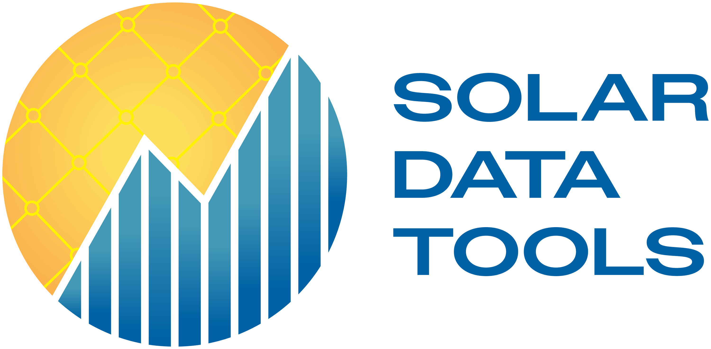

Solar Data Tools Documentation
==============================

|PyPI release| |Anaconda Cloud release|

.. |PyPI release| image:: https://img.shields.io/pypi/v/solar-data-tools.svg
   :target: https://pypi.org/project/solar-data-tools/
.. |Anaconda Cloud release| image:: https://anaconda.org/slacgismo/solar-data-tools/badges/version.svg
   :target: https://anaconda.org/slacgismo/solar-data-tools

Solar Data Tools is an open-source Python library for analyzing PV power (and irradiance) time-series data. It provides
methods for data I/O, cleaning, filtering, plotting, and analysis. These methods are largely automated and require little
to no input from the user regardless of system type—from utility tracking systems to multi-pitch rooftop systems. Solar Data Tools
was developed to enable analysis of *unlabeled* PV data, i.e. with no model, no meteorological data, and no performance index required,
by taking a statistical signal processing approach in the algorithms used in the package’s main data processing pipeline.
Get started `here <index_getting_started.md>`_ with installation and basic tutorials!

This work is supported by the U.S. Department of Energy's Office of Energy Efficiency and Renewable Energy (EERE) under the Solar Energy Technologies Office Award Number 38529.

.. Important:: These documentation pages are under construction. Contributions are welcome (and much appreciated!), and you can find our contribution guidelines `here <index_dev.md>`__.

.. toctree::
   :maxdepth: 1
   :hidden:

   index_getting_started
   index_user_docs
   index_dev
   index_api_reference

.. grid:: 1 2 2 2
    :gutter: 4
    :padding: 2 2 0 0
    :class-container: sd-text-center

    .. grid-item-card:: Getting Started
        :img-top: ../source/images/getting_started.svg

        New to Solar Data Tools? Check out the getting started guides for installation and general usage information, project details,
        as well as quick links to additional examples and tutorials.

        +++

        .. button-ref:: index_getting_started
            :click-parent:
            :color: primary
            :expand:

            To the getting started guides

    .. grid-item-card:: User Guide
        :img-top: ../source/images/user_guide.svg
        :class-card: intro-card
        :shadow: md

        The user guide provides in-depth information on the key concepts and methods
        of Solar Data Tools with useful background information and explanation.

        +++

        .. button-ref:: index_user_docs
            :click-parent:
            :color: primary
            :expand:

            To the user guide

    .. grid-item-card:: Contribution Guidelines
        :img-top: ../source/images/contributor.svg
        :class-card: intro-card
        :shadow: md

        Saw a typo in the documentation? Want to improve
        existing functionalities? The contributing guidelines will guide
        you through the process of improving Solar Data Tools.

        +++

        .. button-ref:: index_dev
            :click-parent:
            :color: primary
            :expand:

            To the contribution guidelines

    .. grid-item-card:: API Reference
        :img-top: ../source/images/api.svg
        :class-card: intro-card
        :shadow: md

        The reference guide contains a detailed description of the Solar Data Tools API, describing how the methods work
        and which parameters can be used.

        +++

        .. button-ref:: index_api_reference
            :click-parent:
            :color: primary
            :expand:

            To the API reference
